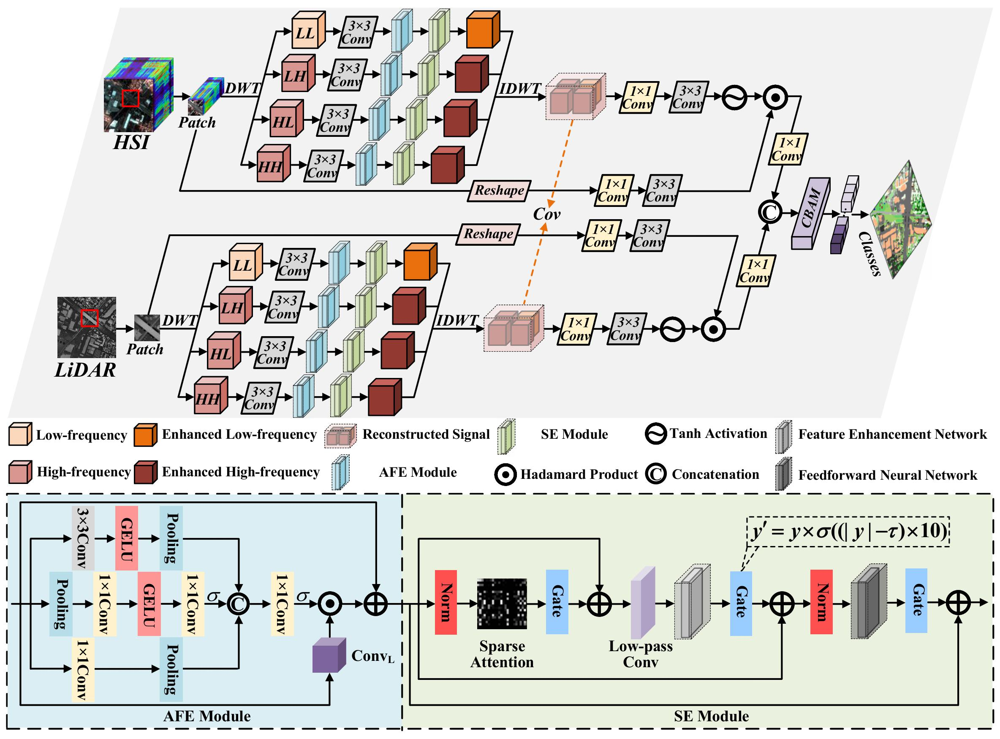

# AFDSE : Multimodal Data Fusion Classification via Adaptive Frequency Domain Sparse Enhancement 

Xiao Wei, Bing Tu, Bo Liu, Jun Li, Antonio Plaza, "Multimodal Data Fusion Classification via Adaptive Frequency Domain Sparse Enhancement", IEEE Transactions on Geoscience and Remote Sensing, 2025

> 💡 **Abstract:**  *Achieving efficient fusion of multimodal remote sensing (RS) data from spaceborne platforms for improved land cover classification performance remains a major challenge in remote sensing research. However, existing multimodal data fusion methods in the frequency domain are often affected by noise interference, feature redundancy, and feature imbalance. To address these issues, this article proposes an Adaptive Frequency Domain Sparse Enhancement (AFDSE) architecture, designed to improve classification performance through frequency feature enhancement and joint multimodal feature learning. Specifically, an Adaptive Frequency Enhancement (AFE) module is designed, which combines task-driven dynamic weight learning with Laplacian convolution kernels to selectively enhance local detail information. In addition, a Sparse Enhancement (SE) module is introduced, which first captures spatial correlations using a sparse attention mechanism, then enhances global structural information through a feature enhancement network, and finally applies sparse activation to the features using a feedforward neural network. Furthermore, a gated fusion mechanism is incorporated to deeply integrate original intra-modal and frequency-domain features, ensuring stable information propagation across deep network layers. Experimental results on three publicly available benchmark datasets demonstrate that AFDSE outperforms existing state-of-the-art methods. This work offers new insights into frequency-domain feature learning for multimodal RS data and highlights the effectiveness of a deep fusion strategy across spatial, spectral, and frequency domains.*

**Fig. 1. Overall architecture of AFDSE for multimodal RS image fusion classification. AFE is the Adaptive Frequency Enhancement Module for adaptive enhancement of local detail information. SE is the Sparse Enhancement Module that eliminates redundant information, suppresses noise interference, and enhances global structural information.** 

## Dependencies

Python 3.9

PyTorch 2.5.0 (with CUDA 12.1)

## Usage
For any questions, feel free to contact us  [weixiao0124@126.com](mailto:weixiao0124@126.com).

## Citation
If you find the code helpful in your research or work, please cite the following paper.
